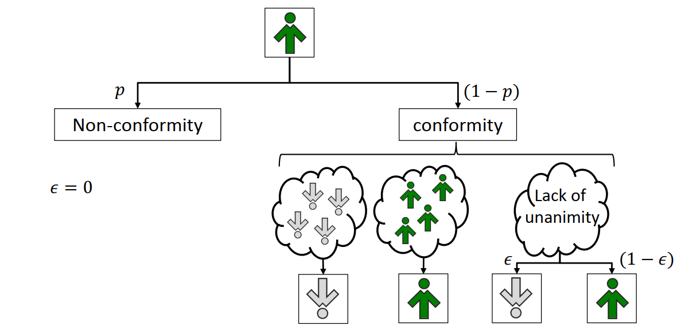



***

<a href="https://github.com/robertjankowski/ga-openai-gym" target="_blank">ga-open-ai</a>
======

<table>
<col style="width:35%">
<col style="width:65%">
<thead style="background-color:white;border:0px" >
  <tr>
    <th style="border: 0px"></th>
    <th>The main aim of the project was to train neural networks using genetic algorithms. For that task I used OpenAI Gym environments. In brief as there are multiple input neural networks with randomly initialized weights and biases. During evolution the best two parents are selected to create modified children (crossover and mutation). The genotype is the flatten weights and biases matrix of each candidate (neural network). I was able to train 3 agents using this approach (even CNN network with over 787k parameters).</th>
  </tr>
</thead>
</table>

<a href="https://github.com/robertjankowski/real-q-voter" target="_blank">real-q-voter</a>
======

<table>
<col style="width:35%">
<col style="width:65%">
<thead style="background-color:white">
  <tr>
    <th style="border: 0px"></th>
    <th>I decided to conduct various experiments on the q-voter model, which is widely using in sociophysics. 
    How the number of agents influence the dynamics of the system? What is the impact of the network topology (directed and undirected)? What if we select agents based on their degree (the number of friends), not completely randomly? To answer those question I've made multiple simulation and plot the relationship between independence factor and mean opinion.</th>
  </tr>
</thead>
</table>

<a href="https://github.com/robertjankowski/reproducing-dl-papers" target="_blank">Own implementation of selected publications</a>
======

* CNN for text classification
* CNN for complex network classification
