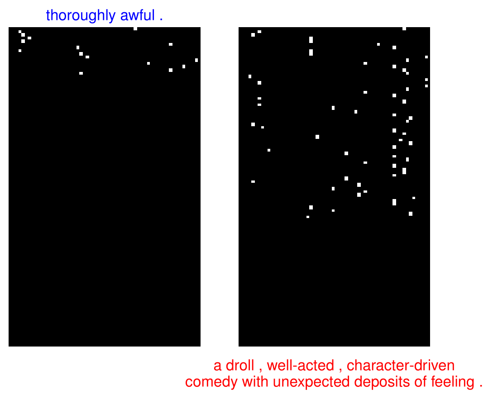
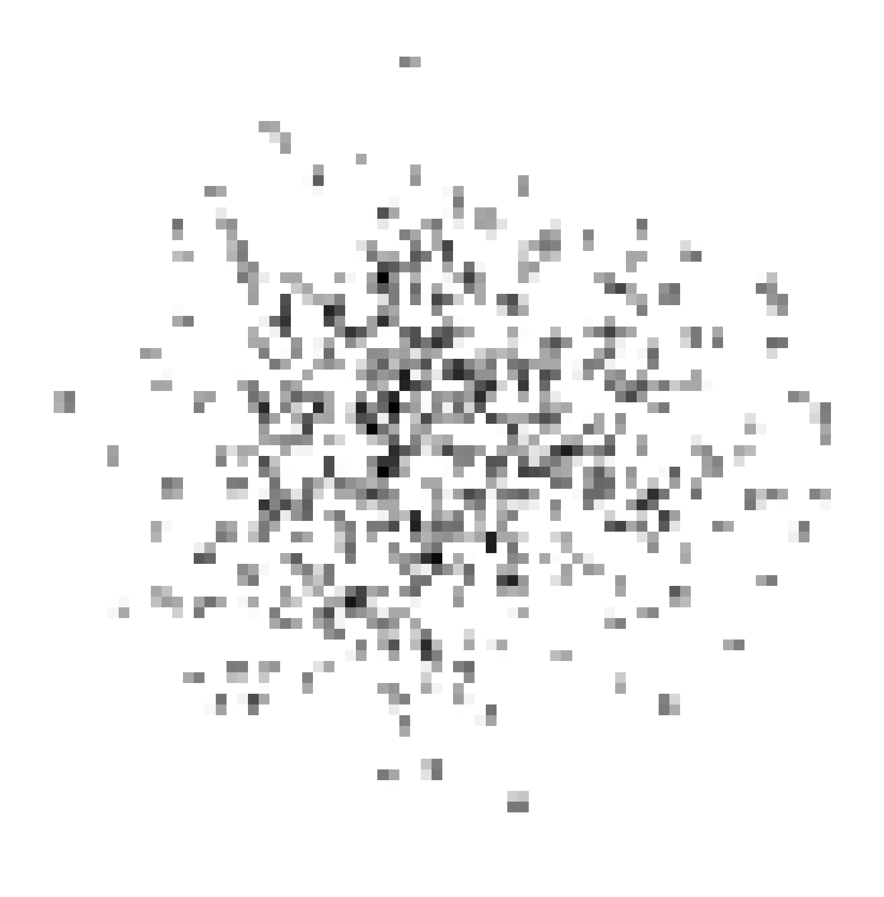



***

<a href="https://github.com/robertjankowski/ga-openai-gym" target="_blank">ga-open-ai</a>
======

<table style="border:0px">
<col style="width:35%">
<col style="width:65%">
<thead style="background-color:white;border:0px" >
  <tr>
    <th style="border: 0px"></th>
    <th style="border: 0px">The main aim of the project was to train neural networks using genetic algorithms. For that task, I used OpenAI Gym environments. In brief, the initial population consists of neural networks with randomly initialised weights and biases. During evolution, the best two parents are selected to create modified children (crossover and mutation). Finally, the genotype is represented as the flatten weights and biases matrix neural network. In conclusion, I trained three agents using this approach (even CNN network with over 787k parameters, see gif on the left).</th>
  </tr>
</thead>
</table>

***

<a href="https://github.com/robertjankowski/real-q-voter" target="_blank">real-q-voter</a>
======

<table style="border: 0px">
<col style="width:35%">
<col style="width:65%">
<thead style="background-color:white;border:0px">
  <tr>
    <th style="border: 0px"></th>
    <th style="border: 0px">I decided to conduct various experiments on the q-voter model, which is popular in sociophysics.
    How the number of agents influences the dynamics of the system? What is the impact of the network topology (directed and undirected)? What if we select agents based on their degree (the number of friends), not entirely randomly? I've made multiple simulations and plotted the relationship between the independence factor and mean opinion to answer those questions.</th>
  </tr>
</thead>
</table>

***

Own implementation of selected publications
======

### [Sentiment classification of movie reviews with CNN](https://github.com/robertjankowski/reproducing-dl-papers/tree/master/conv_net_text_classification)

<table style="border: 0px">
<col style="width:35%">
<col style="width:65%">
<thead style="background-color:white;border:0px">
  <tr>
    <th style="border: 0px"></th>
    <th style="border: 0px">Based on two papers by Yoon Kim [1] and Xiang Zhang <i>et. al</i> [2] I created three neural network architecture: (i) character-level CNN, (ii) world-level CNN, (iii) hybrid approach combining DNN and word-level CNN for the sentiment classification task. The results on the movie review dataset show a slight improvement in merging networks for that task, e.g. (iii). For more information, take a look at <a href="https://github.com/robertjankowski/reproducing-dl-papers/blob/master/conv_net_text_classification/Robert_Jankowski_CNN_Sentiment_Classification.pdf" target="_blank">my report</a>.    [1] Kim, Yoon. "Convolutional Neural Networks for Sentence Classification." Proceedings of the 2014 Conference on Empirical Methods in Natural Language Processing (EMNLP). 2014.
      [2] Zhang, Xiang, Junbo Zhao, and Yann LeCun. "Character-level convolutional networks for text classification." Advances in neural information processing systems. 2015.
    </th>
  </tr>
</thead>
</table>

### [CNN for complex network classification](https://github.com/robertjankowski/reproducing-dl-papers/tree/master/complex-network-classification-with-cnn)

<table style="border: 0px">
<col style="width:30%">
<col style="width:65%">
<thead style="background-color:white;border:0px">
  <tr>
    <th style="border: 0px"></th>
    <th style="border: 0px">
    In paper by Xin <i>et. al</i> [1] the authors first embedded network using DeepWalk algorithm into 2-dimensional space. The rasterised image from 2D-embeddings was the input for CNN. In the last step, I've used a different approach. Namely, I plot 2D embeddings using matplotlib, and with OpenCV, I converted that image into the input to CNN. The network tried to distinguish images from two complex networks: (1) the Barabasi-Albert model and (2) the Watts-Strogatz model. The results in the case of accuracy and AUC were respectively 0.82 and 0.91.    [1] Xin, Ruyue, Jiang Zhang, and Yitong Shao. "Complex network classification with convolutional neural network." Tsinghua Science and Technology 25.4 (2020): 447-457.
    </th>
  </tr>
</thead>
</table>
